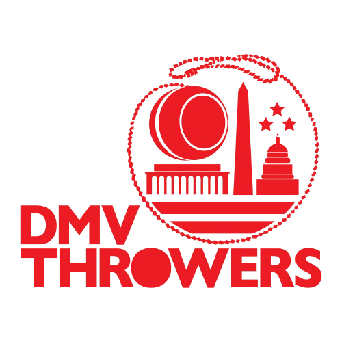

# HTML CSS Refactoring Skill

## Overview
Systematically convert inline CSS styles to proper CSS classes in HTML files, improving maintainability and following best practices.

## When to Use
- VS Code linter shows "CSS inline styles should not be used" errors
- HTML files have repetitive inline styles
- Need to improve code maintainability and organization

## Process

### 1. Identify Issues
Use `get_errors` to find all inline style violations across HTML files.

### 2. Plan CSS Classes
For each unique inline style pattern, create a descriptive CSS class name:
- `header-logo` for logo images in headers
- `footer-title` for title text in footers
- `nav-link` for navigation links
- `event-btn-small` for small buttons

### 3. Add CSS Rules
Add corresponding CSS rules to the embedded `<style>` section:
```css
.header-logo {
  width: 38px;
  height: 38px;
  object-fit: contain;
}
```

### 4. Replace Inline Styles
Replace `style="..."` attributes with `class="..."` attributes:
```html
<!-- Before -->


<!-- After -->

```

### 5. Verify Fixes
Run `get_errors` again to confirm all issues are resolved.

## Benefits
- ✅ Eliminates linting errors
- ✅ Improves maintainability
- ✅ Reduces code duplication
- ✅ Follows CSS best practices
- ✅ Easier to modify styles globally

## Example Application
Applied to 8 HTML files in dmvthrowers.github.io, eliminating 100+ inline style violations while maintaining consistent theming and responsive design.</content>
<parameter name="filePath">c:\Users\91bro\OneDrive\Documents\GitHub\dmvthrowers.github.io\html-css-refactoring.skill.md